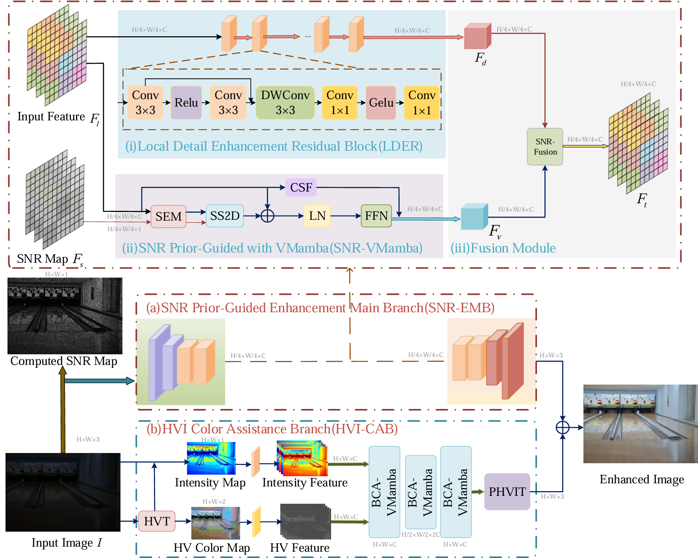

# VMamba-LLIE: Enhancing Low-Light Images with SNR-Guided and HVI Color-Assisted Triple-Branch Network

Enhancing Low-Light Images with SNR-Guided and HVI Color-Assisted Triple-Branch Network

These codes are directly related to the current manuscript submitted to The Visual Computer:Enhancing Low-Light Images with SNR-Guided and HVI Color-Assisted Triple-Branch Network

The model's test results can be downloaded from this link via [Baidu Cloud](https://pan.baidu.com/s/1XRS5WZgn9S40lPI5vugyWA?pwd=g1a5), with the password: "g1a5", applicable to LOLv1 and LOLv2-Synthetic SMID.
<p align="center">
  
</p>

> **Abstract:** Low-light image enhancement remains a challenging task due to the loss of detail and color distortion under insufficient illumination. This paper introduces VMamba-LLIE, a novel triple-branch network that leverages SNR prior guidance and HVI color space assistance for superior low-light image enhancement. The proposed model integrates a global modeling branch for long-range dependency analysis, a local modeling branch for fine-grained detail recovery, and a color assistance branch for high-quality color reconstruction. Extensive experiments across diverse datasets demonstrate that VMamba-LLIE achieves state-of-the-art performance with a smaller model size, outperforming existing methods in both efficiency and effectiveness.
>


## Datasets
If data is empty，please download the dataset from [Datasets](https://github.com/dvlab-research/SNR-Aware-Low-Light-Enhance) and place the data file in the VMamba-LLIE folder.

The final placement should be as follows:
```shell
|--VMamba-LLIE  	
|  	 |--datasets   
|    |    |--LOLv1
|    |    |    |--Train
|    |    |    |    |--input
|    |    |    |    |--target
|    |    |    |--Test
|    |    |    |    |--input
|    |    |    |    |--target
|    |    |--LOLv2-Synthetic
|    |    |    |--Train
|    |    |    |    |--Low
|    |    |    |    |--Normal
|    |    |    |--Test
|    |    |    |    |--Low
|    |    |    |    |--Normal
|    |    |--SMID
|    |    |    |--Train
|    |    |    |    |--SMID_LQ_np
|    |    |    |    |--SMID_Long_np
|    |    |    |--Test
|    |    |    |    |--SMID_LQ_np
|    |    |    |    |--SMID_Long_np
```


## Environment

```shell
conda create -n vmamballie python=3.8
conda activate vmamballie
pip install -r requirements.txt
```

## Run

```shell
python train.py --opt='./options/train/SMID.yml'
```

